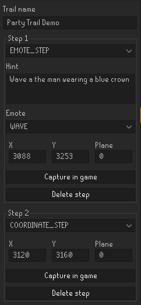
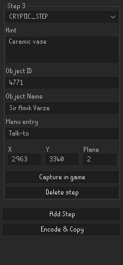
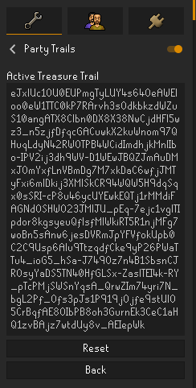
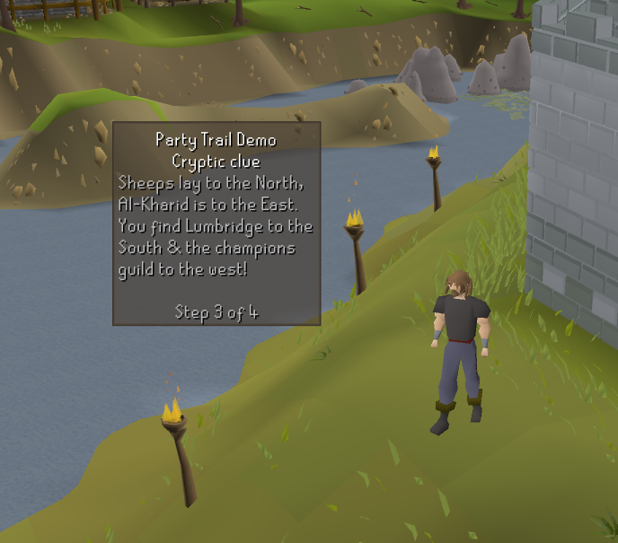

# Player made Treasure Trails

A plugin that allows players to create custom multistep treasure trails which can be 
shared between players. 

## Features

* A custom clue builder panel
* Including world captures to find locations and NPC ids
* Six different step types 
  * Emote, Cipher, Cryptic, Coordinate, Anagram & Skill
* In-game panel showing the current clue step
* Saving trail progres for taking breaks

## Trail builder

Then trail builder allows organizers to create their own treasure trails.
Players can add unlimited[1] amount of steps.
The trail can then be encoded into a textual format, which can be shared with friends.

  
   

[1] Tested with a maximum of 7 steps. 

## Trail config

You can enter the treasure trail string from the builder (or one shared from a fiend) into the plugin configuration panel.
The started trial should show up as a panel in-game as shown below

    
    

